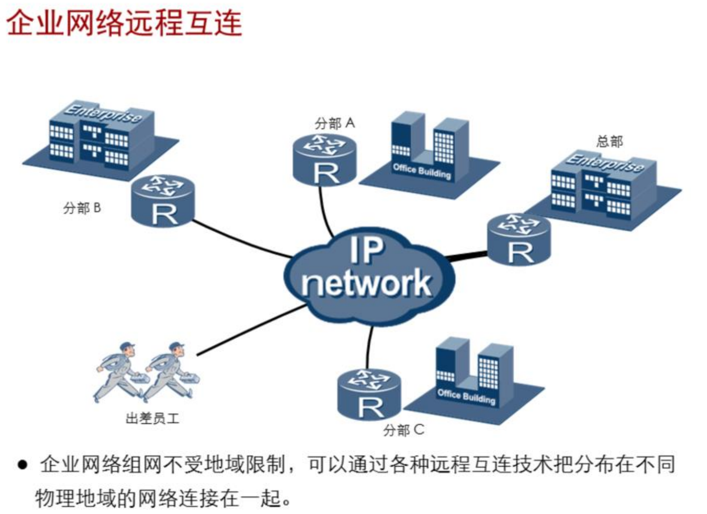

## 企业网络架构介绍

### 企业组网的基本需求

- 与企业的业务及规模密切相关
  - 
- 大型企业通常跨越多个物理位置，需要使用远程互联技术来
  - 连接总部与分支机构
  - 连接企业与合作伙伴或客户
  - 为出差人员提供移动办公
  - 需要考虑数据的私密性和安全性

### 企业网络的基本架构

小型企业网络：

* 采用扁平的网络架构
* 缺乏冗余，可靠性不高

大型企业网络：

* 对业务的连续性要求很高
* 通过网络设备冗余来保证网络的可用性和稳定性
* 采用分层的网络架构
* 需要对资源进行访问控制
* 需要对流量进行细粒度的控制
* 采用模块化设计，实现网络隔离并简化网络维护
