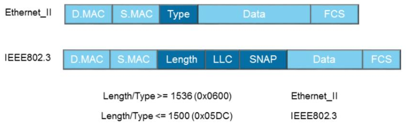
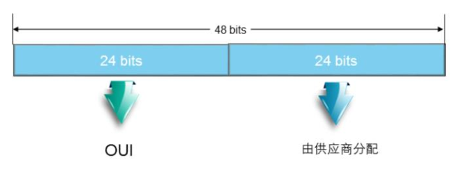

## 以太网帧结构

### OSI分层模型

OSI参考模型各个层次分层如下：

* 物理层：在设备之间传输比特流，规定了电平、速度、电缆针脚
* 数据链路层：将比特组合成字节，再将字节组合成帧，使用链路层地址来访问介质，并进行差错检测；
* 网络层：提供逻辑地址，供路由器确定路径；
* 传输层：提供面向连接或非面向连接的数据传递以及数据重传前的差错检测；
* 会话层：负责建立、管理、终止表示层实体之间的通信会话，该层的通信由不同设备中的应用程序之间的请求和响应组成；
* 表示层：提供各种用于应用层数据的编码和转换功能，确保一个系统的应用层发送的数据能被另一个系统的应用层识别；
* 应用层：为应用程序提供网络服务。


### TCP/IP分层模型

TCP/IP模型将网络分为四层，TCP/IP模型不关注底层物理介质，主要关注终端之间的逻辑数据流转发。

TCP/IP模型的核心是网络层和传输层，网络层解决网络之间的逻辑转发问题，传输层保证源端到目的端之间的可靠传输。

TCP/IP每层都使用该层的协议数据单元PDU（protocol data unit）彼此交换信息，不同层的PDU有不同的名称：

* 传输层：segment（数据段）
* 网络层：packet（数据包）
* 数据链路层：frame (帧)

#### 帧格式

以太网帧有两种格式，如下图所示：



以太网中绝大多数帧都是Ethernet II格式。

**Ethernet II格式**


各个字段的含义如下：

* DMAC：	目的MAC地址，标识帧的接收者；
* SMAC：源MAC地址，标识帧的发送者；
* Type：长度是2字节，标识高层协议；取值为0x0800代表IP协议帧，取值为0x0806代表ARP协议帧
* Data：数据字段是网络层数据，最小长度46字节，最大长度1500字节；
* FCS（循环冗余校验字段）：是一种错误检测机制，该字段4字节。

**IEEE 802.3 格式**

 

与Ehternet II格式类似，不过原来的Type字段别Length取代（数字小于等于1500），并占用了Data字段8个字节用作LLC和SNAP。具体如下：

* Length：定义Data字段包含的字节数（必须小于等于1500）
* LLC（Logical Link Control）：逻辑链路控制，由DSAP（Destination Service Access Point）、SSAP（Source Service Access Point）及Control字段组成；
* SNAP（Sub-network Access Protocol）：有机构代码和类型字段组成。Type字段与Ethernet II帧的Type字段相同。

### MAC地址



MAC地址是全球唯一的，长度是48 bit，分层两部分：

* OUI（Organization Unique Identifier）：IEEE统一分配给设备制造商的代号；
* 后面24 bit由制造商自行分配；

#### 帧的传输

局域网上的帧可以通过三种方式发送

* 单播
  * MAC地址的OUI中，第一个字节第8比特为0，表示这是一个单播地址
  * 帧从单一源发送给单一的目的端
  * 同一冲突域中，所有主机都能收到源主机发送的单播帧，但是发现其目的地址不是本地的MAC地址后，会丢弃收到的帧，只有真正的目的主机才会接收并处理收到的帧
* 广播
  * 帧从单一源发送给共享以太网上所有的主机
  * 广播的目的MAC地址为：`FF:FF:FF:FF:FF:FF`
  * 所有收到该广播帧的主机都要接收并处理帧
  * 大量的广播会导致带宽利用率降低，进而影响整个网络的性能
* 组播
  * 组播可以理解为选择性的广播，主机侦听特定组播地址，接收并处理目的MAC地址为该组播MAC地址的帧
  * 组播目的MAC地址的第一个字节的第8比特为1

帧的接收流程

```
if  frame.dmac != local mac 
    or frame.dmac != boradcast mac
    or frame.dmac != multicast mac; then
	drop frame
endif

calculate fcs;

if frame.fcs is wrong; then
	drop frame
endif

strip frame header and tail;
dispatch frame accounding to type filed;
```

