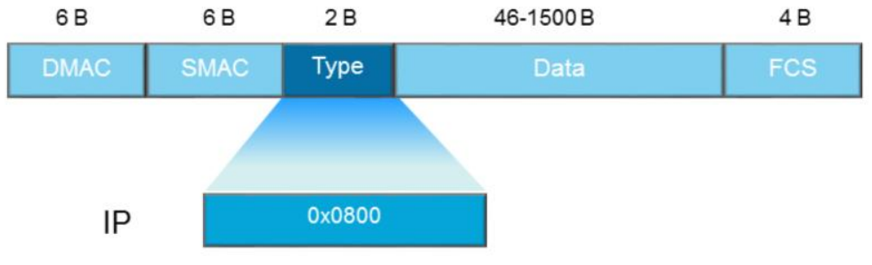
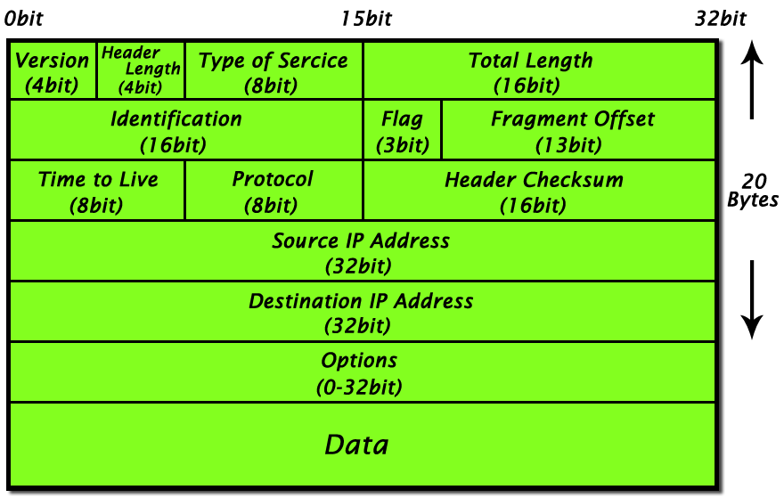
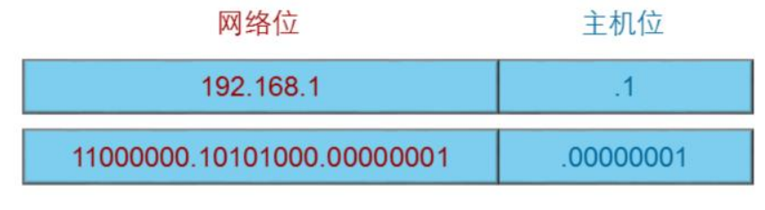
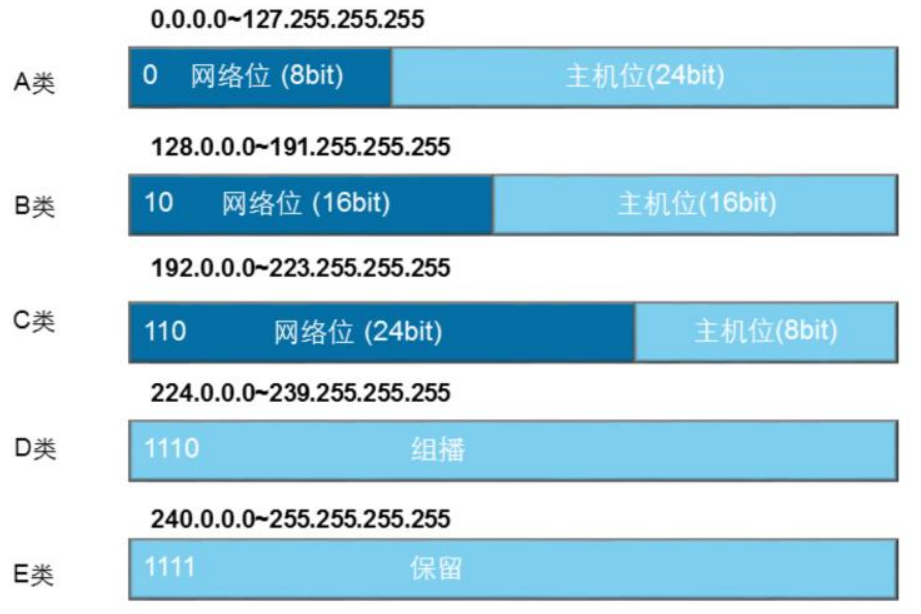

## IP编址

## IP数据帧格式

## IP报文结构

IP报文结构如下图所示：

IP报文头部长度为20~60字节，各个字段的含义如下：

* version：长度4比特；标识目前所使用的IP协议的版本号。一般值为0100（IPv4）和0110（IPv6）
* header length：长度4比特，描述IP头部的长度；注意单位是4字节，如果值为`1111`，那么IP头部长度为15*4=60字节；
* DS Field：早起用来表示业务类型，现在用于支持qos中的差分服务模型，实现网络流量优化；
* total length：长度16比特，以字节为单位计算IP包的长度；
* identification：长度16比特，需要与flags & fragment offset联合使用，实现数据包的分片；
* flags：长度3比特；
  * bit 0：预留，必须为0；
  * bit 1（DF）：表明路由器是否可以对数据包进行分片；为0表示可以，为1表示不能分片；如果不允许分片，且超过了目的链路的MTU，则路由器会丢弃该报文，并返回一个错误信息；
  * bit 2（MF）：为0表示Last fragment，为1表示More fragment；
* fragment offset：数据包分片后，本数据包在原报文的位置；
* time to live：数据包没经过一个路由器，该字段值减少1，如果减为0，则路由器会丢弃改数据包；
* Protocol：标识上层所使用的协议，以便把数据包传递给上层协议处理；
* header checksum：IP头部校验和；
* source IP address：源IP地址；
* Destination IP address：目的IP地址；

## IP编址

IP地址用来标识网络中的设备，IP地址的结构如下：

IPv4的地址为32比特，分成两部分：

* 网络号：表示IP地址所属的网段；
* 主机号：用来唯一标识本网段上的某台网络设备；

特殊的IP地址：

* 网络地址：IP地址的主机位全为0，表示一个网段；

* 广播地址：IP地址的主机位全为1

## IP地址分类

IP地址分成A、B、C、D、E五类。

D类地址为组播地址，主机收到D类地址为目的地址的报文后，且该主机是该组播组成员，就会接收并处理报文。

**私网地址**

为了减少公网地址的消耗，在A、B、C类地址中各预留了一些地址段作为私网地址，这类地址的数据包不能在公网上传输。私网地址默认不能和公网地址进行通信，需要转换为公网地址才能和公网地址通信。私网地址范围如下：

* 10.0.0.0/8
* 172.16.0.0/12 ~ 172.31.0.0/12
* 192.168.0.0/16

**特殊地址**

* 127.0.0.0/8：环回地址，不出网络设备，主要用来诊断网络是否正常；
* 0.0.0.0：标识任何网络，在路由协议中会用到；
* 255.255.255.255：广播地址；

将IP地址划分成5类，带来的一个问题是IP地址使用率低。解决方法是采用VLSM（变长子网掩码）。

## 无类域间路由

无类域间路由（CIDR：Classless Inter Domain Routing）将路由表中的若干条路由汇聚成一条路由，减少了路由表的规模，提高了路由器的可扩展性。

## 网关

如果目的主机和源主机不在同一个网段，报文需要先转发到网关，然后通过网关将报文转发到目的网段。

网关是指接收并处理本地网段主机发送的报文并转发到目的网段的设备。

网关连接本地网段的接口地址就是该网段的网关地址。

## IP包分片

网络中转发的IP报文长度可以不同，如果报文长度超过了数据链路所支持的最大报文长度，则报文就需要分割成若干个较小的片段才能够在链路上传输。将报文分割成多个片段的过程叫做分片。

分片发生在发送到链路层之前，如果链路的MTU不同，就需要执行分片。

分片到达目的IP才会重组。报文在网络传输过程中，可能经过多次分片，因此没有必要在中间设备上进行重组。

因为传输过程中可能发生多次分片，因此，**Fragment Offset**必须是分片在整个IP报文的偏移量，才能在目的端进行重组。
