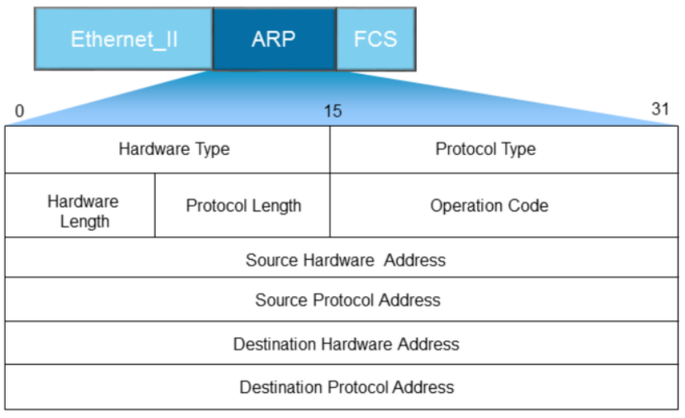
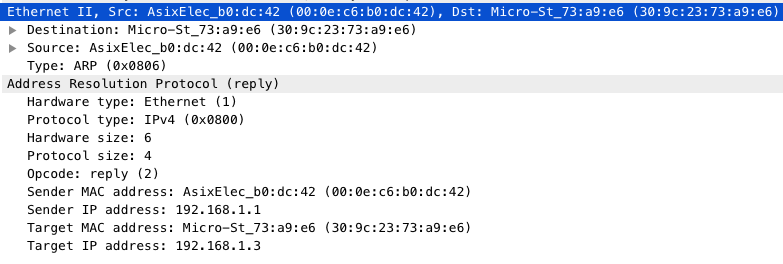
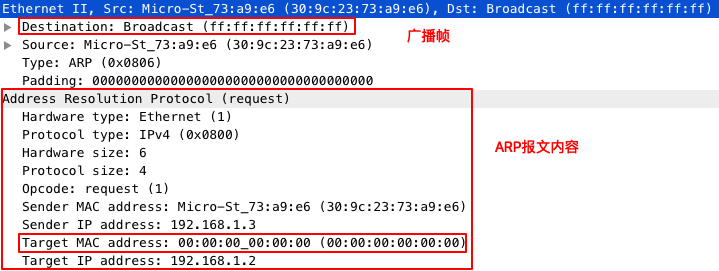
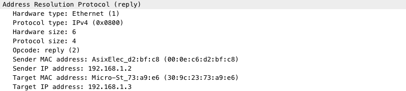
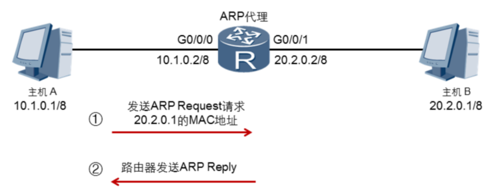

## ARP协议

ARP（Address Resolution Protocol）

网络设备在发送数据给另一个网络设备之前，需要获取下一跳的MAC地址。MAC地址的获取就是通过ARP协议来实现。


### ARP数据包格式

ARP数据包格式如下：



**ARP报文不能穿越路由器，也不能被转发到其他广播域**

各个字段具体含义如下：

* hardware  type：硬件地址类型，一般为以太网；
* Protocol type：三层协议地址类型，一般为IP；
* hardware length：MAC地址长度（单位是字节）
* protocol length：IP地址长度（单位是字节）
* operation code：ARP报文的类型
  * ARP Request：ARP请求报文
  * ARP Reply：ARP回应报文
* Source Hardware Address：发送者的MAC地址
* Source Protocol Address：发送者的IP地址
* Destination Hardware Address：接收者的MAC地址
* Destination Protocol Address：接收者的IP地址

看个实际的ARP报文，下面是一个实际的ARP Reply报文。



### ARP缓存

为了提高IP地址到MAC地址的转换速度，网络设备一般都有ARP缓存，数据发送前，先查找ARP缓存表，缓存表中找不到对方的MAC地址时，才会通过ARP协议获对应IP地址的MAC地址。

如果目的IP地址不在同一个网络，发送者会在ARP缓存中查找网关的MAC地址。

ARP缓存有有效期，过期了就会被自动删除掉。

在linux系统上，可以通过arp命令来查看ARP环境。如下：

```bash
# arp -n
Address                  HWtype  HWaddress           Flags Mask            Iface
192.168.121.77           ether   52:54:00:f7:56:7d   C                     virbr0
192.168.56.177           ether   52:54:00:0b:2a:81   C                     virbr1
192.168.1.2              ether   00:0e:c6:d2:bf:c8   C                     enp0s31f6
192.168.1.1              ether   00:0e:c6:b0:dc:42   C                     enp0s31f6
```

### ARP请求

在ARP缓存表中找不到IP地址对应的MAC地址时，主机会通过广播的方式发送ARP Request报文。报文的内容包括：

* 源IP地址
* 源MAC地址
* 目的IP地址

* 目的MAC地址：`00：00:00:00:00:00`

一个实际的ARP广播报文如下图所示：



上图是`192.168.1.3`这个主机缺少`192.168.1.2`的MAC地址时，发出的ARP广播报文。

### ARP响应

主机收到ARP Request报文后，处理流程如下：

```
if frame.arp.ip == self.ip then
	cache frame.arp.sip & frame.arp.smac
	send arp reply frame
endif
```

一个实际的ARP响应报文如下图所示：



ARP响应报文是单薄报文，报文中源MAC地址是自己的MAC地址，目的MAC地址是原先发生ARP Request的主机的MAC地址。

### ARP代理

如果两台主机位于不同的网络，而且没有配置网关的情况下，通过广播是无法获取对方的MAC地址，这时候如果路由器开启ARP代理功能，双方不配置网关也能实现相互通信。如下图：



开启ARP代理后，路由器收到ARP广播包后，通过查找路由表，发现存在主机B的路由，就会通过`G0/0/0`的MAC地址来响应ARP广播报文。主机A收到ARP Reply之后，就会把数据包发给路由器，通过路由器在转发给主机B。


### 免费ARP


当主机分配了IP地址或IP地址发生了变更，主机必须立即检测其IP地址在网络是是否唯一，以避免地址冲突。检测方法是发送免费的ARP报文，包的特点：

* 帧头部的目的地址是广播地址
* ARP Request报文中源和目的IP地址相同

