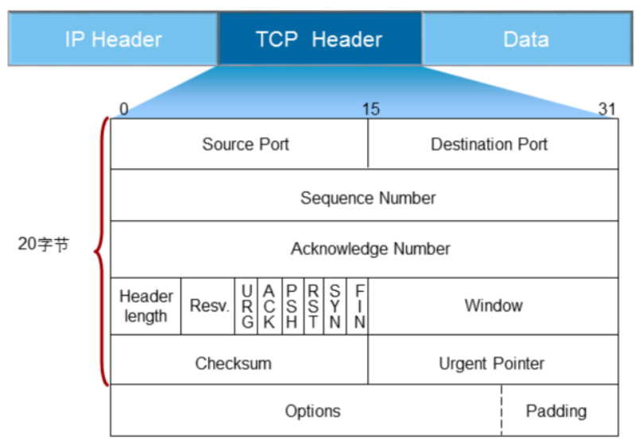
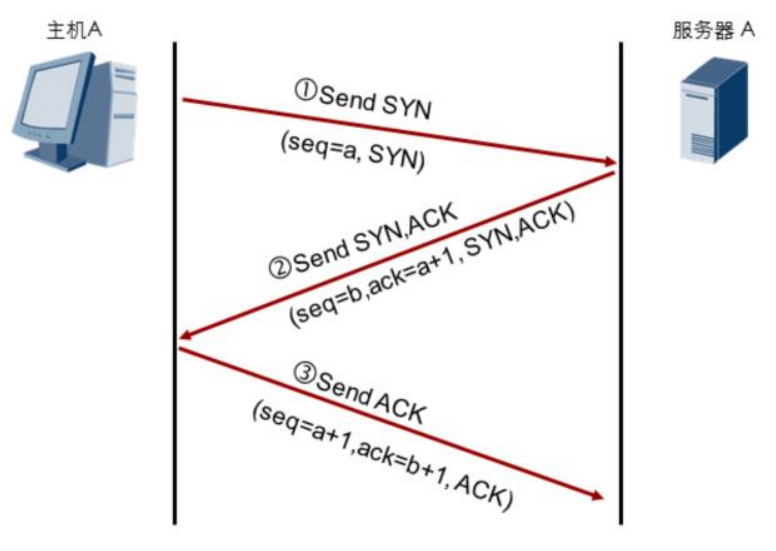
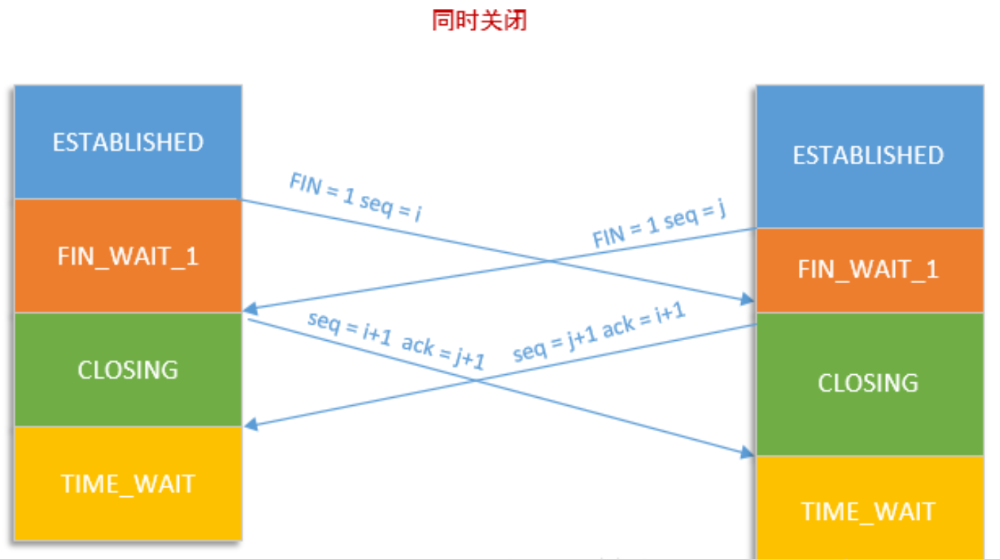
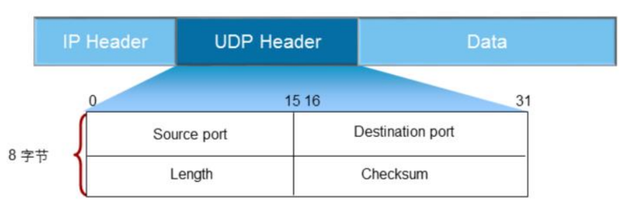

# 传输层协议

传输层最常见的协议就是TCP（Transmission Control Protocol）和UDP（User Datagram Protocol）。

## TCP简介

TCP位于TCP/IP协议的传输层，是一种面向连接的、可靠的、端到端的数据传输协议。

为了区分同一个主机上的不同进程，需要通过端口号来标识不同的服务。

## TCP头部

TCP头部结构如下：

TCP头部正常情况下是20个自己，有Option的情况下，最多60个自己。头部各个字段的含义如下：

* Source Port：源主机上应用程序使用的端口号；
* Destination Port：目的主机上接收程序使用的端口号；
* Sequence Number：用来标识发送端发出的数据段的序号；由于数据包可能不是按顺序到达的，接收方可以通过序列号正确的重组数据段；
* Acknowledge Number：用来表示接收方确认收到的数据段的序列号；确认序列号为发送序列号加1；
* Header Length：TCP头部的长度，单位是32bit（4字节）；因为Header Length是4 bit，所以头部正常为15*4=60字节；
* Window：通常用来表示发送方和接收方可以的缓存大小，用来实现流量控制的；
* Checksum：整个TCP报文（包括TCP头部和数据）的校验和；

## TCP三次握手

TCP建立连接的过程被称为三次握手，三次握手具体的过程如下：

如上图所示：

* 第一次握手：主机A给服务器A发送带有`SYN`标记的报文，并附带上主机A上的序列号`a`（语义：我想和你建立连接）
* 第二次握手：服务器A收到主机A发送过来的报文后，回复一个`SYN+ACK`标记的报文，ACK的序号为`a+1`，并附带上服务器A上的序列号`b`（语义：我接受你的请求，我准备好了）
* 第三次握手：主机A收到服务器A的`SYN+ACK`报文后，会给服务器A发送一个`ACK`报文，ACK的序号为`b+1`（语义：我知道你准备好了；）

**思考：为什么三次握手就够了，如果三次握手中的一个或多个包丢失了如何处理？**

* 经过三次握手之后，主机和服务器都知道对方已经准备好了，可以开始传输数据了；因此从语义上来说是够了。
* 如果第一次握手的数据丢了，主机和服务器无法建立连接；主机侧重试建立连接即可。
* 如果第二次握手的数据丢了，服务器会重发`SYN+ACK`包；服务器上的连接状态会一直停在`SYN_RECV`状态，直到收到ACK包或超时，超时的话，服务器端会发送`RST`包，TCP连接状态变为`CLOSED`状态。
* 如果第三次握手的数据丢了，主机可能会认为连接已经建立；但是服务器上连接状态会一直停在`SYN_RECV`状态，直到收到ACK包或超时。

**思考：如果恶意程序只发送其中的一个或两个包怎么处理？**

* 由于服务器端收到SYN包之后，就会开始分配资源（如：数据包缓存），如果短时间内收到大量的SYN包，服务器就会分配大量的资源，甚至出现资源耗尽的现象。一旦资源耗尽，就不能再提供服务了。这种类型的恶意攻击就是`SYN Flood`攻击，利用的就是TCP协议的特点展开攻击。

## TCP关闭连接

由于TCP支持全双工模式传输数据，TCP在关闭连接时需要四次挥手，确保两个方向都没有数据要传输了再关闭。

四次挥手的具体过程如下：

* 第一次挥手：客户端数据全部发送完毕，发送一个`FIN`包，希望和服务器断开连接；
* 第二次挥手：服务器都收到`FIN`包之后，所有的数据都收到了，则恢复一个`ACK`包，ACK序列号为客户端的序列号加1；
* 第三次挥手：服务器端所有的数据发送完毕，也会给客户端发送一个`FIN`包，表示服务器端也没有数据要发送了；
* 第四次挥手：客户端收到服务器端的`FIN`包之后，也会给服务器端发送一个`ACK`包，ACK序列号为服务器端的序列号加1；

整个过程及TCP连接的状态转换如下图所示：

上图显示的是一方主动关闭连接时的状态转换图。在一些情况下，通信的双方可能同时发起关闭连接的操作。同时关闭时，状态转换如下图所示：

## UDP协议

UDP（User Datagram Protocol）是一种无连接的传输层协议，不保证网络通信的可靠性。

## UDP头部

UDP头部如下图所示：

各个字段的含义如下：

* Source Port：表示源主机应用程序使用的端口
* Destination Port：表示目的主机应用程序使用的端口
* Length：头部和数据的总长度（以字节为单位）
* Checksum：头部和数据的校验和（可选）

## UDP传输过程

使用UDP传输数据时，需要应用程序自己解决报文排序、流量控制等功能。

优势：

* 不提供重传机制，占用资源少，处理效率高，时延低
* 一些对时延敏感的流量，如语音、视频等，通常采用UDP作为传输协议

