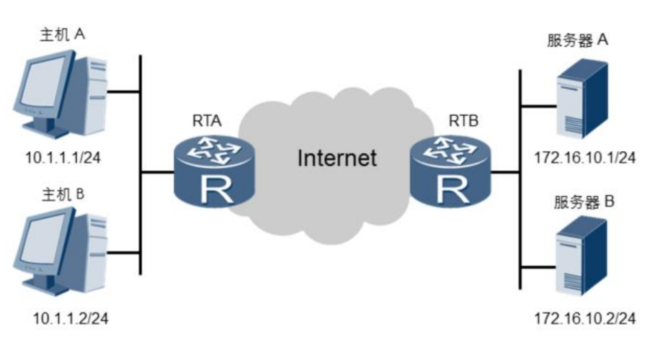
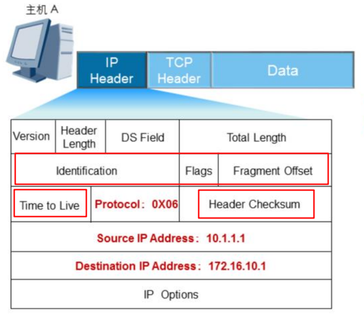

## 数据转发过程

**思考：网络层数据包是如何在相同或不同网段之间转发的?**

网络层数据包转发过程中要解决两个重要的问题：

* 路由：确定将数据包传递给哪个路由器；
* 分片：如果与下一跳路由器之间的MTU变小了，需要进行分片；


下面结合一个具体的例子看数据的转发过程。如下图，主机A要访问服务器A提供的Web服务。




假设双方已经建立TCP连接，主机A上的端口是1027，服务器A上的端口是80。

### 1. TCP封装

主机A的应用程序调用操作系统提供的接口发送数据，操作系统将数据封装成数据段，并填充TCP头部的源和目的端口号、序列号 & ACK号、Window字段、标志位、校验和等信息。如下图：


填充好这些必须的字段后，操作系统就会将数据段传递给网络层处理。

### 2. IP封装

数据段传递到网络层之后，网络层需要填充：IP的版本号、协议号、源和目的IP地址等信息，如果进出的链路MTU不一致，还需要对数据包进行分片，设置分片信息。如下图：



此外，为了减小网络环路造成的影响，路由器还会对TTL进行减1，如果减为0就会丢弃该数据包。

### 3. 查找路由

填充完网络层所需的各个字段后，接下来就需要通过查路由表，确定将数据包的下一跳了。

主机A和服务器A不在同一个网段，因此，需要通过路由器进行转发。主机A查找路由表会匹配到`0.0.0.0`这条路由，这条路由代表 “任何网络”。因此，主机A会将数据包发送给`10.1.1.254`，也就是网关。

### 4. ARP

确定了下一跳的IP地址之后，在封装成以太网帧之前，还需要知道网关的MAC地址。

主机A首先会查找本机的MAC缓存表，如果没有找到网关对应的MAC地址，就需要通过ARP协议来获取网关的MAC地址。

### 5. 以太网封装

通过ARP协议获取到下一跳的MAC地址之后，就可以开始以太网封装了。


封装成以太网帧的过程中，需要填充源和目的MAC地址及帧的类型。填充完这几个字段后，就可以交给物理层发送出去了。

对于共享链路，物理层通过CSMA/CD算法检测到链路空闲时就可以发送数据。

### 6. 帧的转发

主机A将帧发送出去后，链路上其他设备收到帧后，处理过程如下：

```
calculate FCS;

if frame.fcs is wrong; then
	drop frame;
endif

if frame.dmac != local mac
   or frame.dmac != boardcast mac
   or frame.dmac != multicast mac; then
   drop frame;
endif

strip frame header and tail;
dispatch frame accounding to type filed;
```

### 7. 数据包的转发

经过一跳，现在数据包从主机A传递到路由器RTA了。

RTA收到数据包之后，首先会检查IP报文头部是否完整，然后根据目的IP地址查找路由表，确定能够将数据包转发到目的端。

此外还需要处理报文的TTL，如果到下一跳的链路的MTU变小了，还需要进行分片。

```
if packet.header.checksum is wrong; then
	drop packet;
endif

packet.header.ttl -= 1;
if packet.header.ttl == 0; then
	drop packet;
endif

get nexthop by lookup routing table;

if nexthop.mtu < packet.inport.mtu; then
	split into multiple fragments
endif

get MAC of nexthop

for each fragments
do
	packaging into a frame with nexthop's MAC
	send fragment to nexthop
done
```

### 8. 帧的解封装

数据包继续从RTA传递到RTB，RTB收到之后，转发过程与RTA的过程是一样的。RTB会将数据包发送到服务器A所在的共享链路上，帧的MAC地址是服务器A的MAC地址，这样，只有服务器A收到后，才会处理该帧，并交给网络层继续处理。


### 9. 数据包的解封装

网络层收到数据包之后，首先会检查数据包的头部的校验和，然后检查目的IP地址是否为本机的IP地址。

如果源到目的端发送了分片，则报文要在目的端重新进行组合。

最后，根据头部的协议字段交给传输层进行下一步的处理。


### 10. 数据段解封装

数据包传递到传输层之后，系统会根据目的端口，将数据传递给应用程序。


### 附加

为了更好的理解上面的内容，可以构建下面的拓扑，然后挨个点进行抓包。